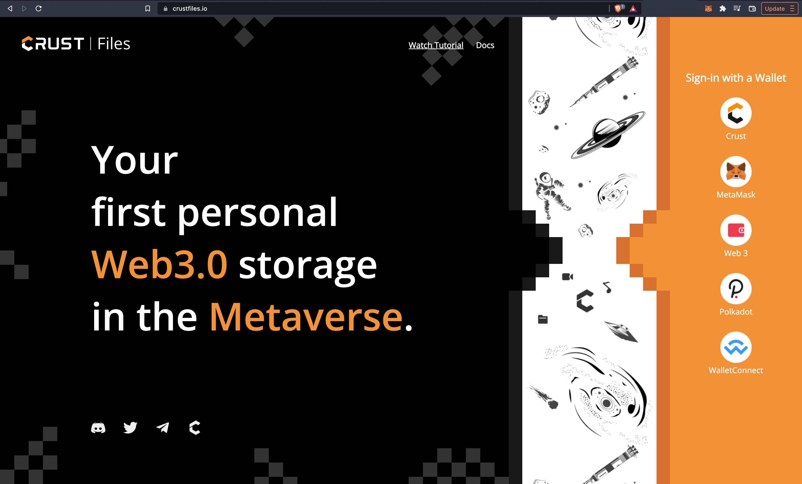
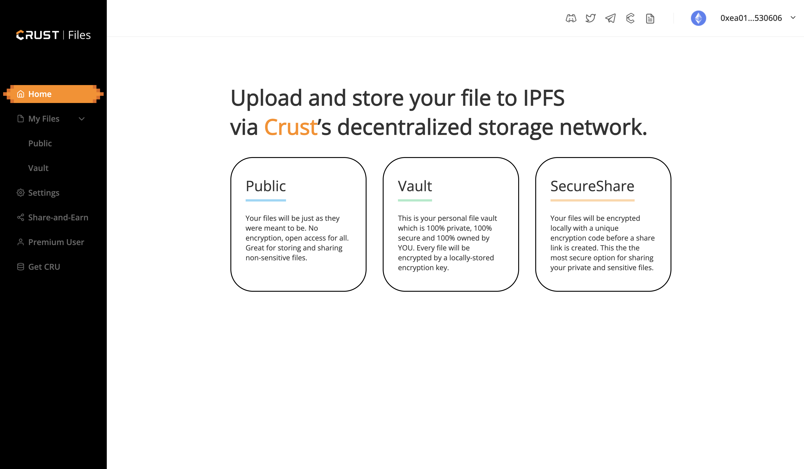
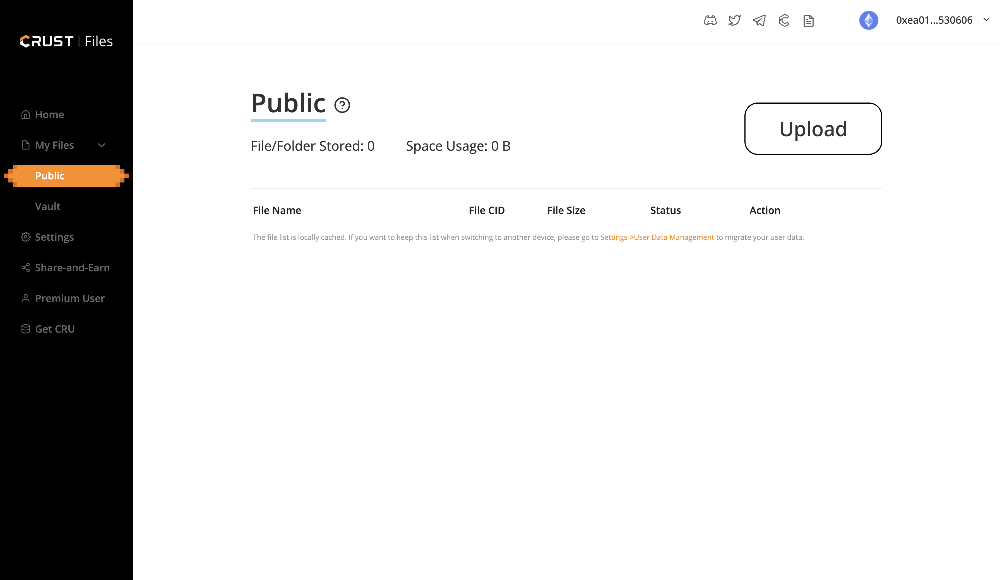
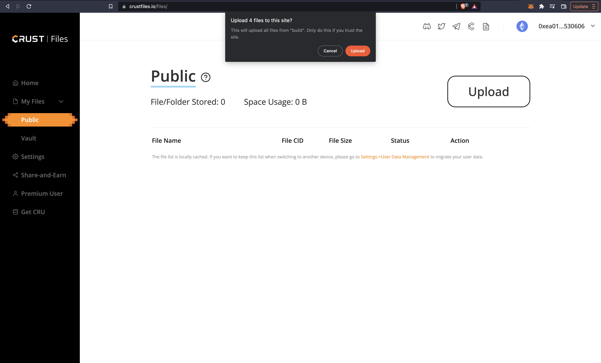
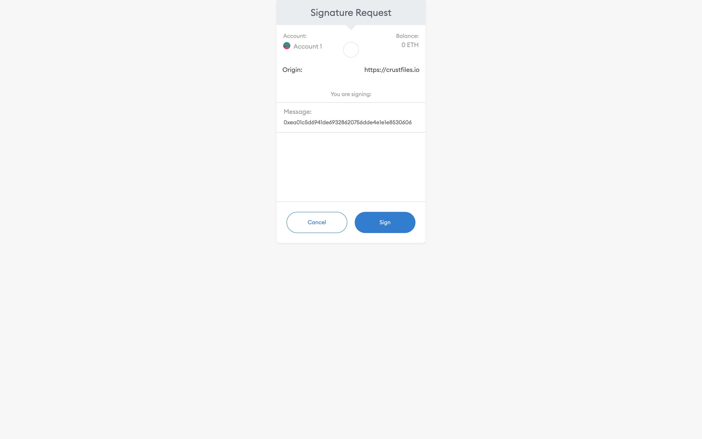
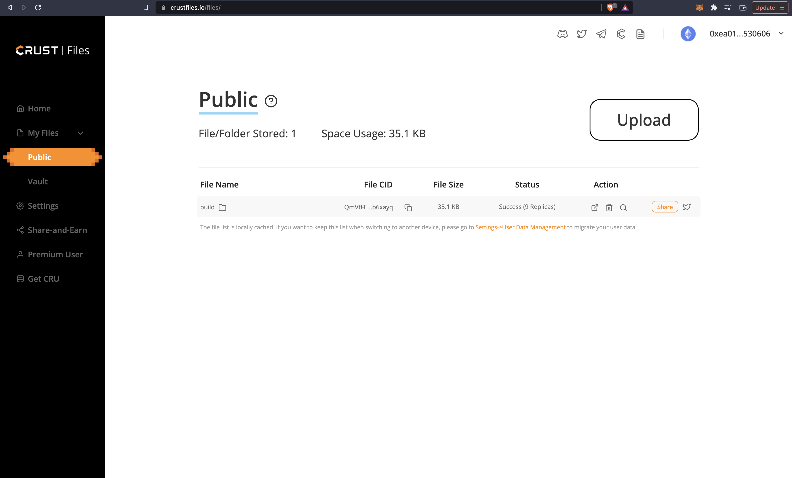

## **Introduction**

In this 5 step guide,  we'll walk you how to deploy your Polywrapper using the `Crust Files`.
so that other dapps could integrate it into their dapps!

## **Table of Contents**
<details>
    <summary>Click to expand</summary>

  * [Introduction](#introduction)
  * [What you need to get started](#what-you-need-to-get-started)
  * [Step 1. Clone the polywrap demo project](#step-1-clone-the-polywrap-demo-project)
  * [Step 2. Pull the polywrap metadata](#step-2-git-pull-metadata)
  * [Step 3. Build the wrapper ](#step-3-build-the-wrapper)
  * [Step 4. Upload the build folder to Crust Network](#step-4-upload-the-build-folder-to-crust-network)
  * [Step 5. Verifying the package on IPFS ](#step-5-verifying-the-package-on-ipfs)


</details>


### What you need to get started:
* We'll be using the [Polywrap Demos](https://github.com/polywrap/demos) repo for this guide. 
* 💚 [Node. js](https://nodejs.org/en/) 
* 👛 [Metamask](https://metamask.io)
*  🥐 [Crust Network](https://crustfiles.io/home/)
* 🐳 [Docker](https://www.docker.com/)
* 🧶[Yarn](https://classic.yarnpkg.com/en/)
    * Versions:  `node >=10.0.0` or `yarn >=1.0.0`
* 🔸 [Git](https://git-scm.com/downloads)


### Step 1. Clone the polywrap demo project  

```bash
git clone https://github.com/polywrap/demos.git
```

### Step 2. Git pull metadata
Then, we will check out the demo branch with the metafiles already set up:

```bash
git pull origin polywrap-metadata
```

### Step 3. Build the wrapper
Now, we can build the sample Polywrapper with the following commands:

```bash
nvm use
yarn
yarn build
```


### Step 4. Upload the build folder to Crust Network

* Make sure you signin using a wallet `Metamask`.




* Click `Public`





* Click `Upload` 



* Upload the build folder then Click Upload 



* Click `Sign and Upload` 


* Your wallet will ask for a signature request 
* Click `Sign`



* The page should look like this: 




### Step 5. Verifying the package on IPFS 
You will get an IPFS hash!

This will lead you to [IPFS link](https://gw.crustapps.net/ipfs/QmVtFE8ScFUv6b4vUrfrNsEGuUunF4rFckjaRcDxb6xayq?filename=build): 

https://gw.crustapps.net/ipfs/QmVtFE8ScFUv6b4vUrfrNsEGuUunF4rFckjaRcDxb6xayq?filename=build


 🎉 Congratulations 🎉 on deploying using the Crust Files!  