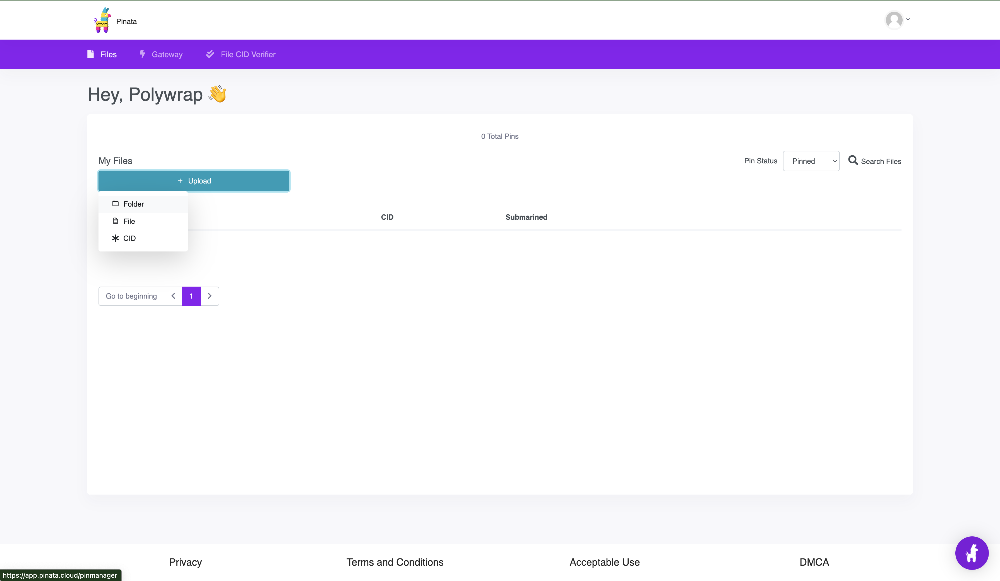
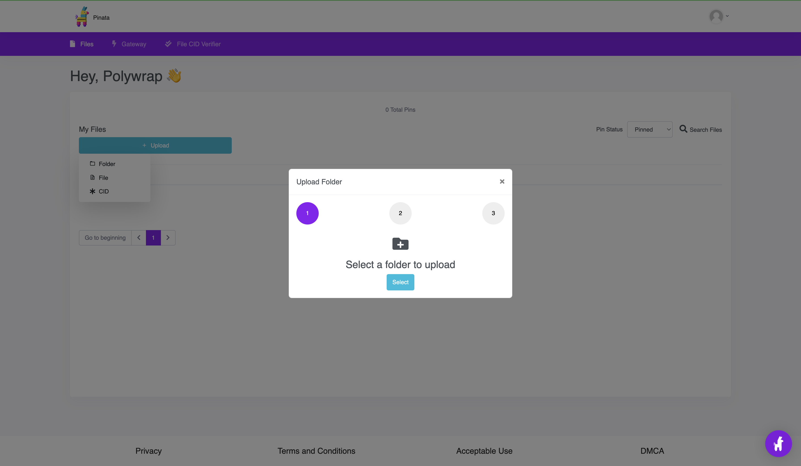
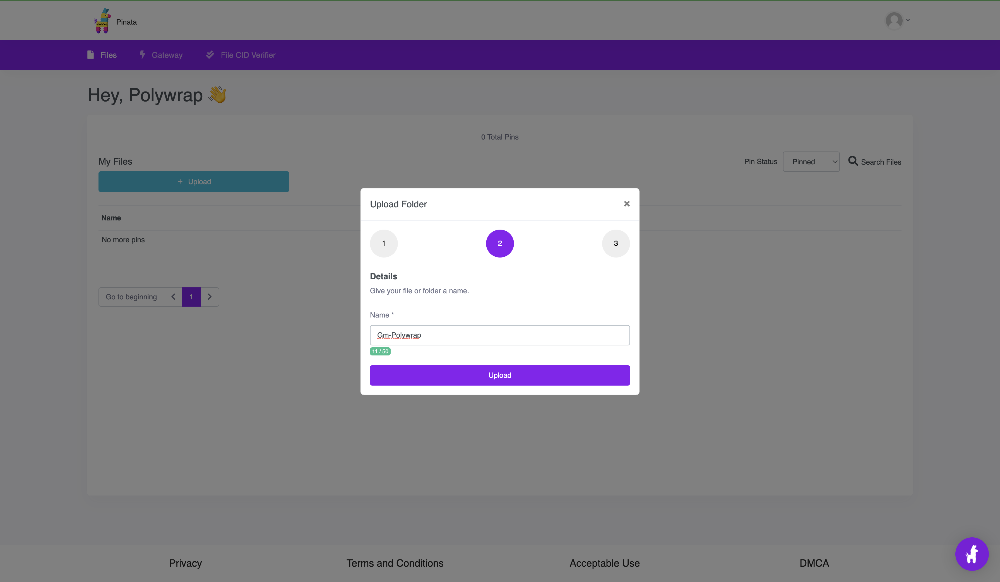
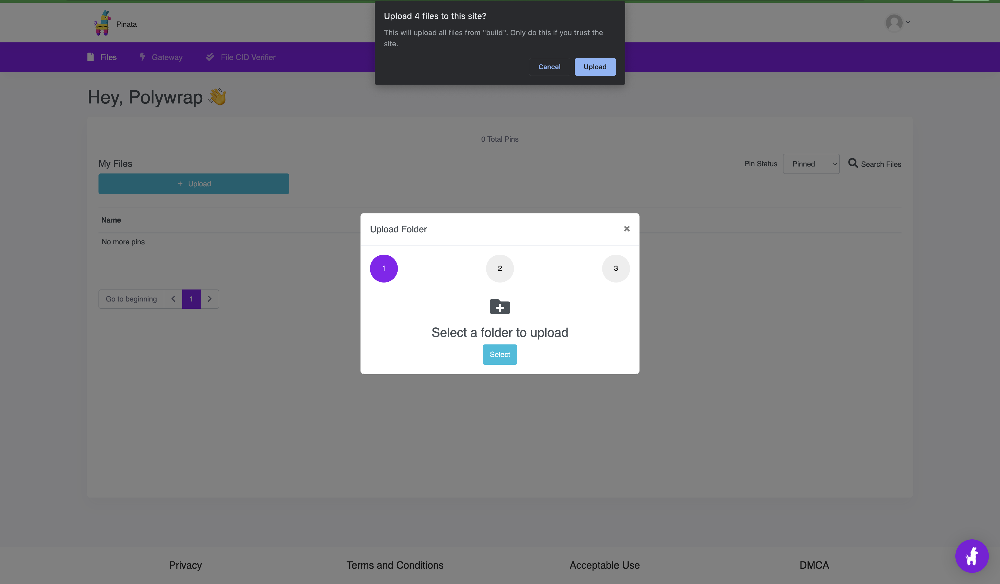
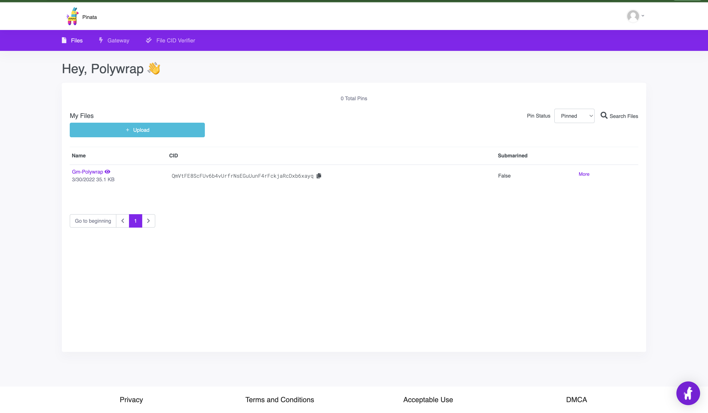

## **Introduction**

In this 5 step guide, we'll walk you through how to deploy your Polywrapper to [Pinata](https://www.pinata.cloud/) so that other dapps could integrate it into their dapps!

## **Table of Contents**
<details>
    <summary>Click to expand</summary>

  * [Introduction](#introduction)
  * [What you need to get started](#what-you-need-to-get-started)
  * [Step 1. Clone the polywrap demo project](#step-1-clone-the-polywrap-demo-project)
  * [Step 2. Pull the polywrap metadata](#step-2-git-pull-metadata)
  * [Step 3. Build the wrapper ](#step-3-build-the-wrapper)
  * [Step 4. Upload the build folder to Pinata](#step-4-upload-the-build-folder-to-pinata)
  * [Step 5. Verifying the package on IPFS ](#step-5-verifying-the-package-on-ipfs)


</details>

### What is Pinata?
Pinata is building the largest pinning service on IPFS!

Pinata gives users the ability to upload, manage, and share their content whenever, wherever and, with whomever they want.


### What you need to get started:
* We'll be using the [Polywrap Demos](https://github.com/polywrap/demos) repo for this guide. 
* 💚 [Node. js](https://nodejs.org/en/) 
* 🪅 [Pinata](https://www.pinata.cloud/)
* 🐳 [Docker](https://www.docker.com/)
* 🧶[Yarn](https://classic.yarnpkg.com/en/)
    * Versions:  `node >=10.0.0` or `yarn >=1.0.0`
* 🔸 [Git](https://git-scm.com/downloads)


### Step 1. Clone the polywrap demo project  

```bash
git clone https://github.com/polywrap/demos.git
```

### Step 2. Git pull metadata
Then, we will check out the demo branch with the metafiles already set up:

```bash
git pull origin polywrap-metadata
```

### Step 3. Build the wrapper
Now, we can build the sample Polywrapper with the following commands:

```bash
nvm use
yarn
yarn build
```

Your `build` folder should be generated now. Copy and paste the `./web3api.meta.yaml` and `./meta` files into the `build` folder.

### Step 4.  **Upload the build folder to Pinata**

Make sure you signup for a Pinata account. 

* Click `"Upload"`


* Click `"Folder"`



* Click `Select`  for a folder to upload should be the build folder 



* Give your file or folder a name.
Example: Gm-Polywrap



* Click "Upload" from the alert message




### Step 5.  **Verifying the package on IPFS**
You will get an IPFS hash!

* Click the name of the folder 



This will lead you to [IPFS link](https://gateway.pinata.cloud/ipfs/QmVtFE8ScFUv6b4vUrfrNsEGuUunF4rFckjaRcDxb6xayq): 
https://gateway.pinata.cloud/ipfs/QmVtFE8ScFUv6b4vUrfrNsEGuUunF4rFckjaRcDxb6xayq

Now that you have the IPFS hash located in the CID column in the pinata manager, you can use it as a value in the URI property of your Polywrap queries to access the mutation and query functions on this Polywrapper. 

 🎉 Congratulations 🎉 on deploying to Pinata!  